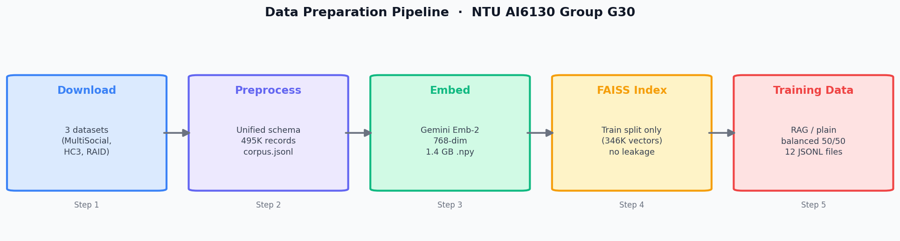
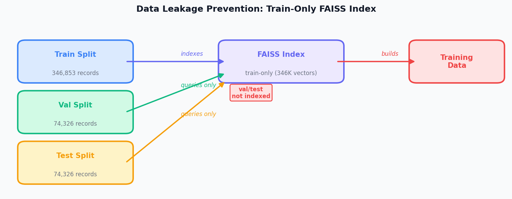

<!-- ─── SECTION TITLE ─────────────────────────────────────────── -->

# Data Preparation

**Yu Taek Lee** · NTU AI6130 Group G30

---

<!-- ─── SLIDE 1: DATASETS ─────────────────────────────────────── -->

## Datasets

Processed records used in this pipeline:

| Dataset | Records | Description | Role |
|---------|--------:|-------------|------|
| **MultiSocial** | 410,087 | 7 AI models · 5 platforms · 22 languages | Training + eval |
| **HC3** | 85,418 | Processed human / ChatGPT answer records (English) | Training |
| **RAID** | 671,391 | Adversarial eval texts (local `raid_eval.jsonl`) | Eval only |
| **Total corpus** | **495,505** | MultiSocial + HC3 · stratified 70 / 15 / 15 | — |

 

- MultiSocial: real social media posts across Twitter, Discord, Telegram, Gab, WhatsApp
- RAID is kept **separate**: never mixed into training or validation

---

<!-- ─── SLIDE 2: PIPELINE ──────────────────────────────────────── -->

## Pipeline Architecture

- Each step outputs a persistent artifact — pipeline is fully resumable
- Embedding uses **Gemini Embedding 2** (CLASSIFICATION task type, 768-dim)

---

<!-- ─── SLIDE 3: KEY DESIGN DECISIONS ────────────────────────── -->

## Key Design Decisions

### Unified Schema
- Column auto-discovery handles naming variations across datasets
- Text cleaning: URLs → `[URL]`, whitespace collapsed, < 5-word records dropped

### Leakage Prevention

- FAISS index built on **train split only**
- Val/test query the index but are never indexed
- Retrieval neighbors are always training examples

### Class Imbalance
- Raw corpus: 80.7% AI / 19.3% human (4.18 : 1)
- Balanced variant: undersample → **50 / 50**, 133K records
- Both variants provided; downstream team chooses

---

<!-- ─── SLIDE 4: OUTPUTS ───────────────────────────────────────── -->

## What Was Handed Off

| Artifact | Size | Used by |
|----------|------|---------|
| `corpus.jsonl` | 197 MB | EDA, model input |
| `embeddings.npy` | 1.4 GB | KNN baseline, RAG retrieval |
| `corpus.index` (FAISS) | 1.0 GB | RAG context at inference |
| `splits.json` | 8.7 MB | Reproducible train/val/test |
| `train_balanced_with_rag.jsonl` | 221 MB | Balanced RAG fine-tuning input |
| standard and balanced val/test JSONL outputs | — | Model evaluation |
| `raid_embeddings_checkpoint.npz` | partial | RAID adversarial eval ⚠️ |

 

> **RAID embeddings: 450,000 / 671,391 (67%) saved in checkpoint.** Resumable if full adversarial evaluation is needed.
